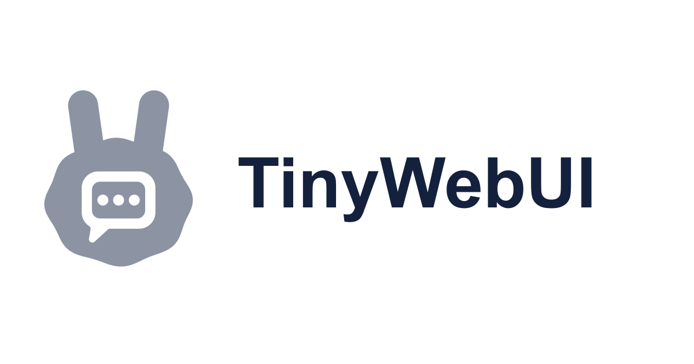

<div align="center">

# TinyWebUI

<a href="https://tinysuite.dev">
  
</a>

**A small, local-first chat workspace for any OpenAI-compatible model, with MCP tools.**

Part of [TinySuite](https://tinysuite.dev). Comes with [TinySearch](https://github.com/TinySuiteHQ/TinySearch) and [TinyContext](https://github.com/TinySuiteHQ/TinyContext) already connected.

[](https://tinysuite.dev)
[](https://www.npmjs.com/package/tinywebui)
[](https://www.npmjs.com/package/tinywebui)
[](https://github.com/TinySuiteHQ/TinyWebUI/actions/workflows/test.yml)
[](LICENSE)
[](https://nodejs.org)
[](https://github.com/TinySuiteHQ/TinyWebUI/releases)
[](https://github.com/TinySuiteHQ/TinyWebUI/commits/main)
[](https://discord.gg/mFFKF9bf5e)


<sub>From a fresh start, using DeepSeek V4.1 Flash through OpenRouter. The wait during the research turn is shown at 4× speed. <a href="docs/demo.mp4">Full-resolution video</a>.</sub>

[Quick start](#quick-start) · [Configuration](#configuration) · [MCP tools](#mcp-tools) · [Chats and attachments](#chats-and-attachments) · [Search](#search) · [Automations](#automations) · [Long chats](#long-chats-caching-and-compaction) · [Statistics](#usage-statistics) · [Access tiers](#access-three-tiers) · [Deployment as code](#deployment-as-code) · [CLI](#cli-reference) · [Security](#security-and-limits) · [Development](#development)

</div>

---

TinyWebUI is the chat interface of [TinySuite](https://tinysuite.dev), a set of small, local-first tools for AI agents. Bring an endpoint (OpenRouter, OpenAI, Groq, Ollama, vLLM, LM Studio, or anything else that speaks the OpenAI API), pick a model and a system prompt, and start working. Chats, documents and tool output stay in one SQLite file on your machine. There is no hosted backend, no account to create, no build step and no frontend framework.

It comes pre-loaded with two TinySuite MCP servers, so a new install can already search the web and remember things:

- **[TinySearch](https://github.com/TinySuiteHQ/TinySearch)** searches, reads and reranks the web locally, then gives the model only the evidence worth putting in its context. It doesn't need a search API key.
- **[TinyContext](https://github.com/TinySuiteHQ/TinyContext)** is a local long-term memory. It saves short memories in SQLite and recalls only what fits the token budget.

You can add any other MCP server next to them, or remove them (see [MCP tools](#mcp-tools)).

Out of the box it is a personal workspace with no login. It can grow into a team deployment, with gateway sign-in, roles, per-user data and an admin panel, without changing anything else.

## Highlights

- **Durable conversations.** Chats are stored in SQLite, with edit, retry, rewind, folders and full-text search. A running turn belongs to the server, not the browser tab, so you can reload, close the laptop and come back to it.
- **Steer a turn while it runs.** Press Enter while the model is working and your message reaches it at the next safe point. Press Alt+Enter to hold the message as a follow-up instead.
- **Web search and memory included.** [TinySearch](https://github.com/TinySuiteHQ/TinySearch) and [TinyContext](https://github.com/TinySuiteHQ/TinyContext) are connected from the first start.
- **MCP over stdio, Streamable HTTP or SSE.** Calls that can change something wait for your approval. Read-only calls in the same round run in parallel.
- **Attachments.** Text and source files, PDFs, DOCX and images. HEIC and AVIF photos are converted automatically. Files you attached before can be reattached from a library.
- **Hybrid local search.** BM25 combined with a small on-device embedding model searches documents and past chats. Nothing leaves the machine.
- **Long chats that stay affordable.** Prefixes are deterministic, so prompt caches get reused. Large tool results are compacted once, and the full output stays one `expand_context` call away. Old turns are summarised when the window has to move.
- **You can see what you spend.** Every round shows its token use, cache reads and cache writes. The statistics view breaks each request down by where the tokens went.
- **Automations.** Cron-scheduled prompts that run in a chat of your choice. The model can create them too.
- **Scales up when needed.** You can add a password for remote access, or put it behind an SSO gateway for a team with roles and an admin panel.
- **Managed from files.** Every setting can come from version-controlled config, which hot-reloads, refuses typos and has a fingerprint you can check against a running instance.
- **Themes.** Fall Fairy and Cyber Grid are included. See [theme authoring](public/themes/README.md) to write your own.

## Quick start

Requires **Node.js 22.13** or later. The bundled TinySearch and TinyContext servers also need **[uv](https://docs.astral.sh/uv/)**. It fetches them, and Python 3.12 if necessary, the first time they start.

```bash
npx tinywebui
```

Or from a clone of this repository:

```bash
npm install
npm start
```

Open <http://127.0.0.1:7777>. Use `--port` and `--host` to change where it listens.

> **Search model.** `npm start` first downloads the default embedding model (about 90 MB) into `models/`, once. `npx tinywebui` skips that step and uses keyword search until you run `npx tinywebui models pull fast`. See [Search](#search).

### Docker

```bash
cp example.tinywebui.config.json tinywebui.config.json   # add your API key
docker compose up --build
```

The default image is Debian slim and has hybrid search, with the embedding model baked in at build time. `Dockerfile.lexical` builds a small Alpine image with keyword search only. Both images keep data in a `/data` volume and have a `/readyz` health check. The images don't include uv, so mount an `mcp.json` that connects to TinySearch and TinyContext over HTTP, for example running in their own containers, or one that leaves them out. [docs/deploy.md](docs/deploy.md) walks through a full scripted deployment.

### Development mode

`npm run dev` restarts the server when `src/` or `bin/` change. Files in `public/` are served as-is, so a browser refresh is enough for them.

## Configuration

Start from the example:

```bash
cp example.tinywebui.config.json tinywebui.config.json
```

> [!WARNING]
> `tinywebui.config.json` holds your API keys, including each connector's, and the Settings panel writes them there so the file alone reproduces an instance. It is gitignored, so keep it that way. If you commit a config, leave the keys out and supply them through the environment instead (`TINYWEBUI_API_KEY`); a connector's `apiKey` can't come from an environment variable yet, so keep connectors out of committed config or use `tinywebui.config.js`.

The Settings panel can change the model, system prompt, generation settings, tool budget, context controls and enabled tools, and it writes every change back to this file. The sole user or an admin also gets an **Admin** block there for the endpoint, connectors, model catalog and advanced model behaviour. API keys are write-only: the browser learns that one is set and its last four characters, never the value, and leaving the field blank keeps the stored key.

**OpenRouter:**

```json
{
  "baseUrl": "https://openrouter.ai/api/v1",
  "apiKey": "sk-or-...",
  "model": "deepseek/deepseek-v4.1-flash",
  "systemPrompt": "You are a terse, precise assistant.",
  "maxToolRounds": 12
}
```

**A local runtime** (Ollama, vLLM, LM Studio, llama.cpp…): point `baseUrl` at its API and leave out `apiKey`.

```json
{
  "baseUrl": "http://localhost:8080/v1",
  "model": "qwen3-coder-30b-a3b-instruct"
}
```

### Environment variables

| Variable | Effect |
| --- | --- |
| `TINYWEBUI_CONFIG` | Path to the config file (`.json`, or `.js`/`.mjs`, see [Deployment as code](#deployment-as-code)) |
| `TINYWEBUI_MCP` | Path to `mcp.json` (default: next to the config file) |
| `TINYWEBUI_DB` | Path to the SQLite database (default: `tinywebui.db` next to the config file) |
| `TINYWEBUI_API_KEY`, `OPENROUTER_API_KEY` | API key; overrides the file |
| `TINYWEBUI_BASE_URL`, `TINYWEBUI_MODEL` | Endpoint and model; override the file |
| `TINYWEBUI_RETRIEVAL_MODE` | `auto`, `lexical`, `dense` or `hybrid` (see [Search](#search)) |
| `TINYWEBUI_MODELS_DIR` | Where embedding models are stored (default `models/`) |
| `TINYWEBUI_PASSWORD` | Tier-2 password, for containers (see [Access](#access-three-tiers)) |
| `TINYWEBUI_SESSION_SECRET` | Signs session cookies. Set it so that sessions survive a restart |
| `TINYWEBUI_LOG_LEVEL` | `debug`, `info` (default), `warn`, `error` or `silent`. Audit events are always written |

Every log line is tagged with its area, for example `[tinywebui:mcp]`.

### Settings reference

| Setting | Default | What it does |
| --- | --- | --- |
| `maxToolRounds` | `12` | Tool-use budget for one user message. A model response that calls one or more tools uses one round. |
| `askUserTimeoutSeconds` | `120` | How long an `ask_user` question waits before the run continues on the model's own assumptions. `0` waits until the question is answered or the run is stopped. Automation runs never wait. |
| `toolApproval` | `"writes"` | Which tool calls need your approval: `"writes"`, `"all"` or `"off"`. See [Tool approval](#tool-approval). |
| `cache` | `true` | Prompt-cache shaping where the provider supports it. |
| `cacheMode` | `"auto"` | `auto`, `implicit` (stable prefix only), `explicit` (Anthropic `cache_control`), `rolling` (OpenRouter) or `off`. |
| `cacheTtl` | `"5m"` | Anthropic cache lifetime. `"1h"` costs more to write and suits chats with long pauses between turns. |
| `reasoningReplay` | `"auto"` | Which reasoning earlier assistant turns send back: `reasoning_details` (OpenRouter, Anthropic-style), `reasoning_content` on tool-call turns (direct DeepSeek), or `omit`. Set it for a gateway that `auto` doesn't recognise. |
| `compactThreshold` | `60000` | History tokens (system prompt and tool definitions excluded) at which older tool results are compacted. `0` disables it. |
| `keepTurns` | `2` | How many recent user turns keep their tool results in full. |
| `compactMinSaved` | `20000` | The minimum number of characters a compaction must remove to be worth the cache miss it causes. |
| `maxInlineChars` | `30000` | Tool results larger than this are stubbed for later turns as soon as they arrive. |
| `maxTurnChars` | `120000` | Tool results larger than this are stubbed even within the turn that fetched them. |
| `maxHistoryTokens` | `100000` | Hard window. Beyond it, the oldest turns stop being sent to the model, but they stay in the transcript. `0` disables it. |
| `llmCompaction` | `true` | Before the window drops turns, the chat's model summarises them. This costs one extra request each time the window moves. If the summary fails, the turns are simply dropped. |
| `compactionMaxTokens` | `8192` | Output limit for that summary. Reasoning models think within this limit, and a cut-off summary is rejected, so leave headroom. |
| `expandCharBudget` | `8000` | The most one `expand_context` call can return. |
| `timezone` | `""` | IANA zone used for today's date and for automations. Empty uses the server's zone. |
| `extraBody` | `{}` | Merged into every completion request. Gateway-specific options go here. |
| `dbPath` | `""` | Database location. Empty means `tinywebui.db` next to the config file. |

The model is told its full tool budget and today's date. The last tool result of each round ends with a note of the rounds left, and that note becomes a warning for the final two rounds. When the budget is spent, TinyWebUI makes one last request with tools disabled, so the model answers from the evidence it already has.

The full schema, including the access and retrieval settings, is in [docs/config.schema.json](docs/config.schema.json). You can also print it with `tinywebui schema`.

### Model catalog

By default, any model id works. To fix the list of models people can use, and to name and tune each one, add a `models` catalog:

```json
{
  "model": "quick",
  "models": [
    { "id": "quick", "label": "Quick", "description": "Everyday questions",
      "model": "deepseek/deepseek-v4.1-flash", "temperature": 0.3 },
    { "id": "deep", "label": "Thorough", "model": "anthropic/claude-sonnet-5",
      "systemPrompt": "You are a careful research assistant...", "maxToolRounds": 20,
      "extraBody": { "reasoning": { "effort": "high" } } }
  ],
  "access": { "roles": { "user": { "models": ["quick"] } } }
}
```

- **`id`** is the name everything else uses: the `model` setting, role model lists and each person's saved choice. **`model`** is the provider's id; if it is left out, the `id` is sent.
- **People only see `label` and `description`.** They can't type in an id, and the provider id never reaches the browser.
- **Per-model overrides.** An entry can set `systemPrompt`, `temperature`, `maxTokens`, `maxToolRounds`, `cacheMode`, `cacheTtl`, `reasoningReplay` and `extraBody`. These replace the global values for turns with that model, except `extraBody`, which is merged with the global one.
- **`"enabled": false`** hides an entry but keeps its settings. Anyone who had picked it falls back to the default model. The default must be an enabled entry.
- **`connector`** names an entry in `connectors` (`{ "id", "label", "baseUrl", "apiKey" }`), so one catalog can mix endpoints. Without it, an entry uses the top-level `baseUrl` and `apiKey`.
- **`tags`** (`vision`, `reasoning`, `tools`) say what a model can do. An untagged model is treated as unknown and allowed everything; a tagged model without `vision` refuses image attachments in the page.
- **Editable from the UI by the sole user or an admin**, in Settings, with the same checks as the file. Startup, reload and every save refuse a catalog with an unknown key, a duplicate id, or a reference to an entry that doesn't exist.

## MCP tools

MCP servers are defined in `mcp.json` next to the config file, in the same shape that MCP desktop clients use.

### Pre-loaded: TinySearch and TinyContext

Until an `mcp.json` exists, TinyWebUI starts with these two TinySuite servers, launched by [uv](https://docs.astral.sh/uv/):

```json
{
  "mcpServers": {
    "tinysearch": {
      "command": "uvx",
      "args": ["--python", "3.12", "--from", "tinysuite-search[server]", "tinysearch"]
    },
    "tinycontext": {
      "command": "uvx",
      "args": ["--python", "3.12", "--from", "tinysuite-context[server]", "tinycontext"]
    }
  }
}
```

| Server | What the model gets |
| --- | --- |
| [TinySearch](https://github.com/TinySuiteHQ/TinySearch) | Web search, clean Markdown from pages, and a browser for pages that need clicking. It runs locally and needs no search API key. [Docs](https://tinysuite.dev/docs/tinysearch/). |
| [TinyContext](https://github.com/TinySuiteHQ/TinyContext) | Memory across chats: it saves short memories and recalls the relevant ones within a token budget. Stored locally in SQLite. |

The first start takes a little longer while uv fetches the packages. TinyContext also downloads its embedding model once.

**Without uv**, TinyWebUI still starts and everything else works. The two servers are just switched off, and it tells you why:

- **On the command line**, startup ends with `tinycontext, tinysearch off until uv is installed: https://docs.astral.sh/uv/`, and `tinywebui doctor` reports both as failed for the same reason.
- **In the app**, both servers show **needs uv** in the tools menu and the MCP panel, with an **Install uv** link.

Install uv and restart TinyWebUI; no other setup is needed. The restart matters because the uv installer adds itself to your `PATH` only for programs started after it.

Saving the MCP panel writes these servers to `mcp.json`. After that the file is in charge: edit it to change them, or remove them to leave them out. An empty `{ "mcpServers": {} }` means no servers at all.

### Adding servers

`example.mcp.json` has the two TinySuite servers plus a disabled HTTP example. Copy it to start, then add servers like these:

```bash
cp example.mcp.json mcp.json
```

```json
{
  "mcpServers": {
    "files": {
      "command": "npx",
      "args": ["-y", "@modelcontextprotocol/server-filesystem", "."]
    },
    "research": {
      "url": "http://127.0.0.1:8000/mcp",
      "headers": { "Authorization": "Bearer ..." }
    }
  }
}
```

- **Stdio servers** take `command`, `args`, `env` and `cwd`.
- **Remote servers** take `url`, optional `headers`, and `"transport": "sse"` for SSE. The default transport is Streamable HTTP.
- **`"disabled": true`** keeps a server defined but disconnected.

The MCP panel validates and saves `mcp.json`, then reconnects without a restart. You can switch off single tools without disconnecting their server. The model sees tools under stable `server__tool` names.

### Tool approval

A tool call that can change something waits for you. It appears in the transcript with its arguments and three choices: **allow**, **always allow this tool** and **deny**.

- A tool counts as read-only only when its server marks it with the MCP `readOnlyHint` annotation. Any tool without that mark is treated as one that can write.
- `toolApproval` sets the policy: `"writes"` (default) asks before any call that isn't read-only, `"all"` asks before every call and `"off"` never asks. The tools panel can override it for a single tool (`confirmTools` / `autoApproveTools`).
- TinyWebUI's built-in tools never ask.
- Scheduled automation runs have no one to ask, so they refuse a call that would need approval and report it.

Calls from one round that are marked both `readOnlyHint` and `idempotentHint` run in parallel. Other calls run one at a time. Either way, the transcript and the results come out in the order the model asked for them.

### Built-in tools

| Tool | What it does |
| --- | --- |
| `read_document` | Searches or reads a document attached to the chat. |
| `search_chats` | Searches your earlier conversations (never the current one) and returns the questions with the answers they got. |
| `expand_context` | Searches or pages through the full output behind a compacted tool result. |
| `ask_user` | Asks you a question mid-turn, optionally with choices, and waits for the answer. |
| `manage_tasks` | Keeps a checklist for the current chat, shown in the right rail. |
| `manage_automation` | Creates, edits and runs scheduled [automations](#automations). |

## Chats and attachments

**Conversations** are stored in `tinywebui.db`. You can edit and resend a message, retry an answer, rewind, file chats into folders and search them all. The search covers your messages and the final answers, but not reasoning, tool calls or raw tool output, so the results stay relevant. An outline on the right edge lists the questions in a long chat, and clicking one jumps to it.

**Turns run on the server.** Reloading or disconnecting doesn't cancel a turn: reopen the chat to rejoin its stream, or press **stop**. While a turn is running, press **Enter** to steer it, or **Alt+Enter** to hold a follow-up that you send when you're ready.

**Documents.** Attach files with the paperclip, by dragging them onto the composer, or by pasting a long block of text. Text and source files, CSV, JSON, PDFs with extractable text and DOCX files are stored as documents for the chat. The model reads the relevant parts with `read_document` instead of getting the whole file in its context. Each document can be up to 5 MiB. Files you attached before can be reattached from the library without uploading them again.

**Images** are sent to the model with the message: up to eight per message, each up to 5 MiB. JPEG, PNG, WebP and GIF are sent as they are, and HEIC and AVIF are converted to JPEG. This needs a model and endpoint that accept OpenAI-style image content.

**Not supported:** OCR (scanned or image-only PDFs are refused with a clear error) and legacy `.doc` files (save them as `.docx` or `.pdf`).

## Search

`read_document` and `search_chats` share one retrieval engine. A chat turn is indexed as the question together with the answer it finally got, without the narration or tool calls in between.

Search is **hybrid** by default. SQLite full-text search (BM25) matches exact words, and a small local embedding model matches meaning, so a question about an "automobile" finds the paragraph about the "sedan". The two rankings are combined with Reciprocal Rank Fusion, using the same ONNX models and fusion as its TinySuite siblings [TinySearch](https://github.com/TinySuiteHQ/TinySearch) and [TinyContext](https://github.com/TinySuiteHQ/TinyContext). Everything runs locally.

- **Install.** `npm install` brings the embedding runtime (`onnxruntime-node` and `@huggingface/tokenizers`, both optional dependencies). The first `npm start` downloads the `fast` model through `tinywebui models ensure`. The Docker image includes it.
- **Fallback.** If the model or the runtime is missing (an offline first start, a platform where onnxruntime can't install, or `npm install --omit=optional`), the default `auto` mode runs BM25 only and logs why.
- **Keyword search only.** To skip hybrid search and the download, run `TINYWEBUI_RETRIEVAL_MODE=lexical npm start` or set `{ "retrieval": { "mode": "lexical" } }`.
- **Pinning the model.** `{ "retrieval": { "mode": "hybrid", "model": "fast", "modelSha256": "<sha256 from tinywebui models pull>" } }` refuses to start with any other model file.
- **No downloads at runtime.** Models only arrive through `tinywebui models pull` / `models ensure` or the Docker build. ONNX Runtime telemetry is switched off.

<details>
<summary><b>How retrieval works, and how to tune it</b></summary>

&nbsp;

**Small-to-big retrieval.** Each document is split twice:

| | Passage | Chunk |
| --- | --- | --- |
| What it is | What `read_document` returns to the model | What gets embedded |
| Size | `passageSize` characters (default 1,800, about 400 tokens) | The embedding model's token limit: 256 for `fast`, 512 for the others |
| Overlap | `passageOverlap` characters (default 200) | `chunkOverlap` tokens (default 32) |
| Used for | BM25 (every mode) and the text the model reads | Dense matching (`dense`, `hybrid`) |

The question is compared with every small chunk, each passage takes its best chunk's score, and the model gets whole passages. Small chunks keep the match precise, and large passages give the model enough context to answer. Chunk size follows the model, so every part of a passage is embedded, even one longer than the model can read at once.

**Modes.**
- `auto` (default): `hybrid` when the model is installed, `lexical` when it isn't.
- `lexical`: BM25 only.
- `dense`: embeddings only.
- `hybrid`: both, fused.

An explicit `dense` or `hybrid` refuses to start without the model instead of falling back. A checksum that doesn't match `modelSha256` stops startup in every mode. `tinywebui models verify` and `tinywebui doctor` show which mode will run and why.

**Models.**

| Preset | Model | Notes |
| --- | --- | --- |
| `fast` (default) | all-MiniLM-L6-v2 | English, about 90 MB |
| `balanced` | bge-small-en-v1.5 | English |
| `quality` | bge-base-en-v1.5 | English |
| `multilingual` | granite-embedding-107m-multilingual (Apache-2.0) | About as fast as `fast`, 430 MB download |

For questions and documents in different languages, keyword matches rarely help, so `dense` mode or a higher `denseWeight` usually ranks better. A custom bundle works with `modelDir`.

**Embeddings are computed once.** Document chunks are embedded when the document is attached, and chat turns when each run ends. Older chats and documents are embedded in the background at startup. Vectors are stored in SQLite, and a query only embeds the question. Switching models re-embeds everything automatically. A turn whose answer changes is re-embedded, and deleting or rewinding removes its vectors.

**Tuning:**
- `passageSize` and `passageOverlap` set what the model gets back. Bigger passages give more context per hit, but fewer hits fit in one result.
- `chunkOverlap` sets how much neighbouring chunks share.
- `denseWeight` (default 0.5) and `rrfK` (default 60) control the fusion.
- `queryPrefix` and `documentPrefix` are for models that expect instructions. For bge, set `queryPrefix` to `"Represent this sentence for searching relevant passages: "`.

Changing these is safe: stored documents are re-split when the passage settings change, and re-embedded when the model or `chunkOverlap` changes.

**Adding a corpus.** The engine in `src/retrieval/retrieval.js` can search any source that describes its units through a small adapter (`units`, `candidates`, `lexical`, `hydrate`…). Register it with `retrieval.register(name, corpus)` and it gets lexical, dense and hybrid search, storage and backfill.

</details>

## Automations

An automation posts its instructions into a chat you choose, on a five-field cron schedule in an IANA timezone. You can create automations in the **automations** view, or ask the model to manage them with `manage_automation`.

- Runs use the current model and enabled tools, and appear both in the chat and in the automation's run history.
- **Run now** triggers one immediately. It waits for the chat's current turn to finish.
- Automations only run while TinyWebUI is running. A run that was missed, or that falls while the chat is busy, is skipped.
- No external notifications are sent.

## Long chats: caching and compaction

Tool results can be much larger than the conversation around them. TinyWebUI keeps every result in full in SQLite, but avoids sending it again and again:

1. **Cache-friendly prefixes.** Between compactions, history is append-only and serialized deterministically, so providers can reuse the matching prompt prefix.
2. **One-time compaction.** When history crosses `compactThreshold`, older tool results are replaced, once, with compact stubs. A stub holds an artifact ID, a hint about the structure, and the first and last lines verbatim. Older images are replaced with a short note.
3. **Nothing is lost.** The model can get the exact content back through `expand_context`.
4. **A moving window as a last resort.** If history is still over `maxHistoryTokens`, which usually happens in a very long chat with few tool calls, the oldest turns stop being sent. The cut falls on a user message and leaves a note that earlier conversation was omitted. With `llmCompaction`, those turns are first summarised (together with any earlier summary) into the system prompt. Rewinding to a point before the cut removes the summary.

**Provider specifics.** On OpenRouter, TinyWebUI sends a stable per-chat `session_id` so sticky routing keeps caches warm, and Claude gets the automatic rolling cache directive. Local and other endpoints get no OpenRouter-only fields. Set `cacheMode` only if your gateway needs a different cache dialect, or set `cache: false` to turn cache shaping off.

## Usage statistics

Every round in the transcript shows its token use, including cache reads and writes when the provider reports them. The **Statistics** view totals usage over time and by model, and can drill down from all time to a single day. Extra summary requests made by `llmCompaction` show up there too.

**Token attribution.** Each assistant request stores a counts-only breakdown of where its tokens went. The input side covers the operator prompt, harness, MCP guidance, tool schemas per server, conversation, reasoning sent back, tool history and results, and images. The output side covers reasoning, tool calls, intermediate text and the final answer.

- The provider's totals and reported reasoning counts are authoritative. Everything else is estimated at about four characters per token, with images counted as 1,500 tokens, and is marked `~`.
- The gap to the provider's total is shown as a signed difference and never rescaled away.
- Cache reads are part of the input, not an extra component.
- Requests made before attribution existed are not reconstructed.

## Access: three tiers

Choose a tier with `authMode`. Each tier keeps everything the previous one has, and switching tiers never hides existing data.

| Tier | `authMode` | For | Sign-in |
| --- | --- | --- | --- |
| 1. Just you | `"none"` (default) | You, on your own machine | None |
| 2. Just you, remotely | `"single"` | You, over a network | A password |
| 3. Users and admins | `"trusted-header"` | A team or organization | Google, Apple, Microsoft, any SSO, through a sign-in gateway |

### Tier 1: just you

There is no login, and every chat, setting and tool belongs to whoever can reach the page. Keep it bound to `127.0.0.1`.

### Tier 2: just you, remotely

```bash
npx tinywebui set-password   # prompts, then writes authMode "single" and a hash to your config
npx tinywebui --host 0.0.0.0
```

- **Only a hash is stored.** The config holds an scrypt hash, never the password. In a container, set `"authMode": "single"` and pass the password in `TINYWEBUI_PASSWORD`.
- **Sessions** use HTTP-only signed cookies. Running `set-password` again ends every existing session.
- **Lockout.** After five wrong passwords, that address is locked out for 15 minutes.
- **HTTPS.** Serve it over HTTPS, for example behind a reverse proxy, whenever it is reachable from outside your machine.

### Tier 3: users and admins

TinyWebUI sits behind a **sign-in gateway** that handles the login, such as Cloudflare Access, oauth2-proxy, Authelia or Authentik. Any identity provider the gateway supports works. The gateway verifies each person and passes their identity in request headers:

```json
{
  "authMode": "trusted-header",
  "trustedProxyCidrs": ["172.20.0.0/16"],
  "trustedUserIdHeader": "x-tinysuite-user-id",
  "trustedEmailHeader": "x-tinysuite-email",
  "trustedNameHeader": "x-tinysuite-name",
  "trustedRoleHeader": "x-tinysuite-role",
  "logoutUrl": "https://<team>.cloudflareaccess.com/cdn-cgi/access/logout",
  "access": {
    "bootstrapAdmins": ["<your gateway user id>"],
    "newUsers": "approved"
  }
}
```

- **Accounts create themselves** on a person's first request. They are keyed on the gateway's stable user ID, not on email, so a changed address keeps the same account.
- **Data is private to each user.** This covers chats, documents, folders, search, automations and usage. The server refuses any request for another user's data by ID, and a test matrix tries every route against another user's IDs.
- **The first admin comes from the config.** Anyone listed in `access.bootstrapAdmins` is always an approved admin.
- **Roles grant [features](#features).** For example, users can be limited to chatting while admins set up models and MCP servers. The gateway can send `admin` or `user` in the role header, but a decision recorded in the files outranks it. A browser can never promote itself.
- **Admins** get an **Admin** item under Statistics, where they can:
  - approve pending users (set `access.newUsers: "pending"` to require approval);
  - disable an account, which returns 403 immediately and stops that user's automations;
  - change roles;
  - read any user's chats, documents and live turns. This view is read-only, and each view is recorded in the audit log.
- **Settings belong to the operator.** Without the `settings` feature, the model, system prompt and approval rules are read-only, and credentials and the gateway address are hidden. Without `mcp`, the MCP servers are hidden. Each person picks their own model from their role's allowed list.
- **Audit log.** New accounts, rejected requests, role and status changes, config changes and admin views are written to stdout as `[tinywebui:audit]` JSON lines. Messages and secrets are never logged.

> [!IMPORTANT]
> Identity headers are trusted **only** from addresses in `trustedProxyCidrs`, based on the real network connection. `X-Forwarded-For` is ignored, and TinyWebUI refuses to start in this mode without that list. The gateway must remove any identity headers a client sends, and TinyWebUI must be reachable only through the gateway, with no published port.

## Deployment as code

Every part of a deployment, down to what each role can see, can be set up from files. An agent or a script can build it, commit it to git and hand it over, and the running app stays in step with the files.

### Configuring from JavaScript

`start()` takes the same settings, so you can run an instance without any files:

```js
import { start } from 'tinywebui';

const server = await start({
  port: 7777,
  config: { apiKey: process.env.OPENROUTER_API_KEY, model: 'anthropic/claude-sonnet-5' },
  mcpServers: { files: { command: 'npx', args: ['-y', '@modelcontextprotocol/server-filesystem', '.'] } },
  configFile: false, // or a path; false reads and writes no config file
  dbPath: ':memory:',
});
// later: await server.shutdown();
```

The `tinywebui` command does the same when it finds `tinywebui.config.js` (or `.mjs`) in the working directory, or when `TINYWEBUI_CONFIG` points at one. The file's default export is the options object, or a function (async is fine) that returns it. `--port` and `--host` still override it.

**Layers apply lowest first:** built-in defaults, the JSON config file, environment variables, then `config` from JavaScript. Keys set in JavaScript are locked: the Settings panel shows them read-only and the API refuses to change them. `tinywebui.config.json` is still read and written for everything else, unless the options set `configFile: false`. In that case changes last only as long as the process. Passing `mcpServers` replaces `mcp.json` and makes the MCP panel read-only.

### Three kinds of setting

| Kind | Where it lives | Can the UI change it? |
| --- | --- | --- |
| **File-only:** `authMode`, passwords, `trusted*`, `logoutUrl`, `dbPath`, `retrieval`, `access` (admins edit the user role's features and models, new-user policy and `customize` through the Admin panel) | `tinywebui.config.js` or `tinywebui.config.json` | Never. The API refuses, even for admins. |
| **Locked:** anything set in `tinywebui.config.js`, including `mcpServers` | `tinywebui.config.js` | No. Shown read-only. |
| **Editable:** everything else | `tinywebui.config.json`, `mcp.json` | Yes, and every change is **written back to the file**. |

- **Freeze everything** with `frozen: true` in either file. Settings, tools and MCP servers then can't be changed from the UI or the API. You change the files and let them reload instead. User data and admins' decisions about users still work normally.
- **Mistakes fail loudly.** An unknown key (usually a typo), a value of the wrong type or a value outside its allowed set stops startup, reload, a UI save and `tinywebui validate`, and every problem is named. Nothing silently falls back to a default.
- **Admin decisions live in the files.** Approving, disabling or changing someone's role writes `access.users` in `tinywebui.config.json` before the database is touched. The files outrank the database: delete the database and restart, and every approval and ban is still in force.
- **Edits apply without a restart.** Changes to `tinywebui.config.json` or `mcp.json` are picked up automatically, or on `kill -HUP`. A reload is all or nothing: a file that doesn't parse or validate is rejected and logged, and the running config stays as it was. Changes to `tinywebui.config.js` or `authMode` need a restart.
- **Fingerprints.** The effective config has a hash that never includes secrets. It is printed at startup, shown in the Admin panel, returned by `/readyz` and included in config-related audit lines before and after each change. Running `tinywebui fingerprint` on the committed files gives the same value, so you can check that a running instance matches a given commit.

### A complete tier-3 setup

```js
// tinywebui.config.js: committed to git, holds no secrets
export default {
  config: {
    authMode: 'trusted-header',
    trustedProxyCidrs: ['172.20.0.0/16'],
    baseUrl: 'http://gateway:8080/v1',            // your model gateway; users never see it
    apiKey: process.env.MODEL_GATEWAY_KEY,
    model: 'fast',
    systemPrompt: 'You are the team assistant…',  // locked: set here, so read-only in the UI
    logoutUrl: 'https://team.cloudflareaccess.com/cdn-cgi/access/logout',
    access: {
      bootstrapAdmins: ['google-oauth2|1234567890'],
      newUsers: 'pending',
      roles: {
        user:  { features: ['chat', 'attachments', 'images', 'search', 'folders', 'model-picker'], models: ['fast', 'smart'] },
        admin: { features: '*' }
      }
    }
  },
  mcpServers: {                                    // locked: users can use these tools, nobody can edit them
    search:  { url: 'http://tinysearch:8000/mcp' },
    context: { url: 'http://gateway:8080/context/mcp' }
  }
};
```

[docs/deploy.md](docs/deploy.md) takes this through a scripted container deployment: validate, migrate, doctor, start and verify the fingerprint.

### Features

A role's `features` list can include any of these. Each one covers both the UI and the API routes behind it: the UI hides what a role doesn't have, and the server refuses it.

| Feature | Grants |
| --- | --- |
| `chat` | Chatting |
| `attachments` | Attaching documents |
| `images` | Attaching images |
| `search` | Searching chats |
| `folders` | Organizing chats into folders |
| `automations` | Scheduled automations |
| `statistics` | The usage view |
| `model-picker` | Choosing a model from the role's list |
| `tools` | Turning tools on and off |
| `settings` | Changing settings |
| `mcp` | Managing MCP servers |
| `admin` | Managing users |
| `oversight` | Reading other users' chats |

**Defaults.** In tier 3, users get everything except `tools`, `settings`, `mcp`, `admin` and `oversight`, and admins get `*`. In tiers 1 and 2 you get everything except user management.

## CLI reference

Output on stdout is JSON or a single line, and logs go to stderr, so scripts can parse the output.

| Command | What it does |
| --- | --- |
| `tinywebui [start] [--port] [--host] [--config]` | Run the server |
| `tinywebui set-password` | Turn on tier 2 and set the password |
| `tinywebui validate [path]` | Prints `ok <fingerprint>`, or lists every problem and exits with code 1 |
| `tinywebui effective [--role user\|admin]` | What is in effect, how each setting can change, and what a role can see and do |
| `tinywebui fingerprint` | Hash of the effective config (never includes secrets) |
| `tinywebui schema` | JSON Schema for the config (also in [docs/config.schema.json](docs/config.schema.json)) |
| `tinywebui migrate [--check]` | Run schema migrations as an explicit step. `--check` exits with code 1 if the database is behind. Set `autoMigrate: false` to make this mandatory. |
| `tinywebui doctor` | Checks Node, config, database, model endpoint and each MCP server |
| `tinywebui users list` | Users, and the decisions pinned in the files |
| `tinywebui users set <id> [--role] [--status] [--clear]` | Record a decision in the config. A running server reloads it. |
| `tinywebui models pull <preset> [--dir]` | Download an embedding model (`fast`, `balanced`, `quality`, `multilingual`) |
| `tinywebui models ensure` | Download the configured model only if it is missing |
| `tinywebui models verify` | Load the configured model the same way startup does |

For orchestrators, `GET /healthz` reports that the process is answering, and `GET /readyz` reports that it can serve requests (`{"ready":true,"version":"…","fingerprint":"…"}`).

## Security and limits

- **Network exposure.** In tier 1, keep TinyWebUI bound to `127.0.0.1`. Use tier 2 or 3 before exposing it to a network.
- **MCP servers** run with whatever access you give them. Treat each configured server and its credentials as trusted infrastructure, and use [tool approval](#tool-approval) for anything that writes.
- **Model output is untrusted.** Model-written text reaches the page only as text or through a Markdown renderer that escapes first, and the server sends strict security headers.
- **Deleting a chat** also deletes its documents, tool output and search vectors.
- **Not included:** OCR, cloud sync and branching chat history.

## Development

```bash
npm test        # the whole suite, about 10 seconds
npm run dev     # restart on changes in src/ and bin/
```

The tests cover message serialization, caching, compaction, the tool loop and approvals, retries, editing, search, streaming and rejoining, settings, password and gateway sign-in, config write-back and reload, and a tenant-isolation matrix. They also enforce the architecture: import directions, the harness boundary, and the stream event registry. [AGENTS.md](AGENTS.md) maps the codebase and says where new code goes.

### Evals

`npm run eval` runs the tasks in `evals/tasks/` against the configured model and scores its behaviour. It checks whether the model uses tools instead of guessing, ignores instructions planted in tool output, reports failures honestly, respects a declined call, and more. Each task scripts its tools' results, so runs are comparable. The checks are deterministic (regex, call counts), except `judge`, which asks the model for a strict PASS or FAIL on one criterion.

```bash
npm run eval -- --repeat 3 --save baseline     # record a reference run
# ...change the prompt or the harness...
npm run eval -- --repeat 3 --compare baseline
```

`--only name,words` runs a subset of tasks and `--model id` tries another model. Results go to `evals/results/`, which git ignores. To add a task, drop a JSON file into `evals/tasks/`; the existing tasks show every type of check.

> [!NOTE]
> Evals make real API calls to your configured endpoint, so they cost money.

## License

[GNU Affero General Public License v3.0 or later](LICENSE). If you run a modified version for users over a network, you must offer them the corresponding source code for that version.
